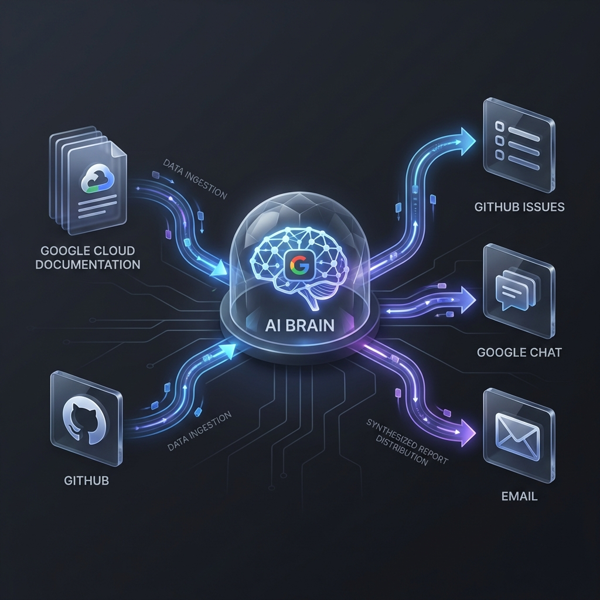
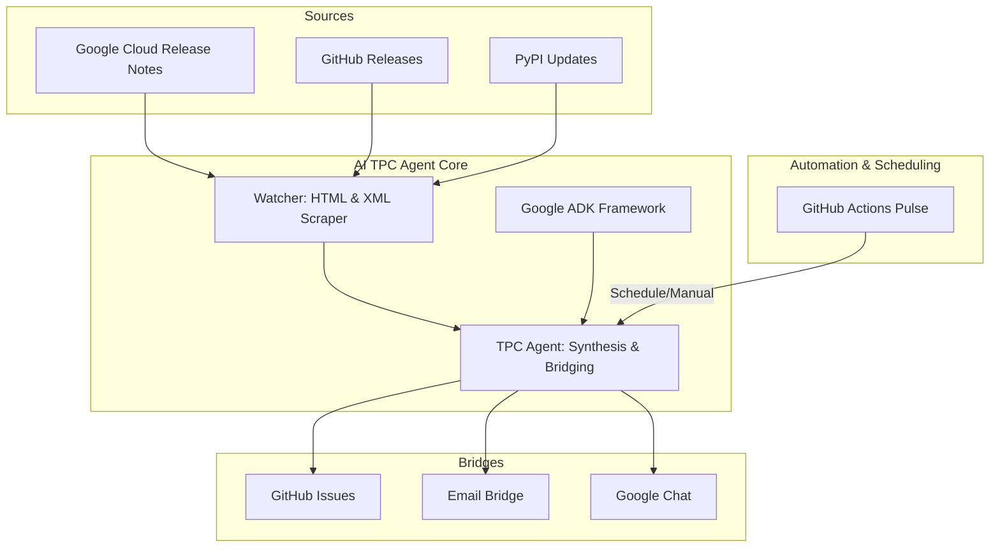

# AI TPC Agent 🚀

Technical Program Consultant (TPC) Agent designed to browse, track, and promote AI knowledge and product roadmaps for field teams.



## Architecture


## Features
- **Ecosystem Watcher**: Automated Python scavengers that track Vertex AI releases, GitHub code shifts, and PyPI updates.
- **Gemini-Powered Synthesis**: Uses **Gemini 2.0 Flash** to translate dry technical changelogs into high-impact "Field Talk Tracks."
- **Professional Multi-Channel Pulse**: Broadcasts professional reports to Email, GitHub Issues, and Google Chat.

## How it Works
The AI TPC Agent follows a structured **Retrieve -> Synthesize -> Promote** lifecycle:

### 1. Automated Retrieval (The "Watcher")
The agent's **Watcher** engine wakes up (via GitHub Actions) and uses custom scrapers to scan:
*   **Official Release Notes**: Vertex AI, Gemini Enterprise, and Generative AI.
*   **Developer Repositories**: Source code movements in the Google ADK and A2UI frameworks.
*   **Industry Trends**: High-signal blogs and market analysis feeds.

### 2. AI Synthesis (The "Brain")
Once retrieval is complete, the raw data is passed to **Google Gemini**. The model performs "TPC Reasoning":
*   **Summarization**: Condenses dense technical notes into 2-sentence business focus.
*   **Bridging**: It identifies the "Sales Play" (e.g., matching a security feature to a FinServ deal blocker).
*   **Formatting**: Cleans the data into email-friendly and markdown-ready blocks.

### 3. Field Promotion (The "Bridges")
The synthesized intel is pushed through various communication bridges:
*   **Email**: A premium HTML report sent directly to field distribution lists.
*   **GitHub Issues**: A persistent, searchable history of all technical pulses.
*   **Google Chat**: Real-time card-based notifications for immediate visibility.

## Installation
```bash
pip install .
```

## Usage
### Local Report
```bash
tpc-agent report
```

### Google Chat Broadcast
```bash
tpc-agent chat --webhook-url "YOUR_WEBHOOK_URL"
```

### Email Promotion
```bash
# Uses TPC_SENDER_EMAIL and TPC_SENDER_PASSWORD env vars
tpc-agent email "ai-tpc-agent@google.com"
```
### GitHub Issues Broadcast
```bash
# Uses GITHUB_TOKEN and GITHUB_REPOSITORY env vars
tpc-agent github
```

## Sample Terminal Output
```text
🚀 AI TPC AGENT: FIELD PROMOTION REPORT (Last 2 Days)

🌉 ROADMAP BRIDGE: FIELD TALK TRACKS
╭─────────────────────────────────────────── [VERTEX-AI-RELEASES] ───────────────────────────────────────────╮
│ Feature: Claude 3.5 Sonnet on Vertex AI                                                                    │
│ Field Impact: PARTNER DEPTH: New Claude models on Vertex. Crucial for customers requesting model-diversity. │
│ Action: Open Documentation                                                                                 │
╰────────────────────────────────────────────────────────────────────────────────────────────────────────────╯
╭────────────────────────────────────────────── [GOOGLE-ADK] ────────────────────────────────────────────────╮
│ Feature: v1.24.0 Release                                                                                   │
│ Field Impact: DEV EXPERIENCE: ADK Update. Promotes standardized agent building. Essential for              │
│ 'Agent-First' architecture talks.                                                                          │
│ Action: Open Documentation                                                                                 │
╰────────────────────────────────────────────────────────────────────────────────────────────────────────────╯

💡 AI KNOWLEDGE & MARKET TRENDS
### Google Cloud AI Blog: Sovereign AI in 2026
Source: Google Cloud AI Blog - Market Trends & Innovations
Actionable Insight: New regulatory trends in EMEA are driving demand for local-residency AI models...
[🔗 Read Full Update]

---
```

## Scheduling (Field Pulse)
The repository includes a GitHub Action (`.github/workflows/pulse.yml`) to automatically process updates.

**Secure Channel Options:**
1. **GitHub Issues (Default)**: Reports are posted as issues in the current repo. Zero-config (uses `GITHUB_TOKEN`).
2. **Google Chat**: Add `GCHAT_WEBHOOK_URL` to GitHub Secrets.
3. **Email**: Add `TPC_SENDER_EMAIL` and `TPC_SENDER_PASSWORD` (App Password) to GitHub Secrets.

## Alternative: Markdown Persistence
If communication channels are restricted, you can run the agent to append to a local log:
```bash
tpc-agent report >> FIELD_PILOT_LOG.md
```

## Intelligence Targets (Powered by Gemini)
The agent is specifically tuned to recognize and bridge these key themes:
- **Agent Builder**: Translating low-code simplicity to pro-code extensibility.
- **Gemini / GE**: Articulating the value of reasoning engines and long-context windows.
- **Claude / Partner Models**: Supporting model-diversity narratives on Vertex AI.
- **Developer Frameworks (ADK/A2UI)**: Promoting standard-first agentic architecture.
- **Sovereign AI**: Matching compliance updates to regional deal blockers.
- **Security**: Connecting IAM/Encryption shifts to enterprise governance themes.
